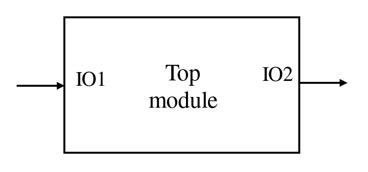
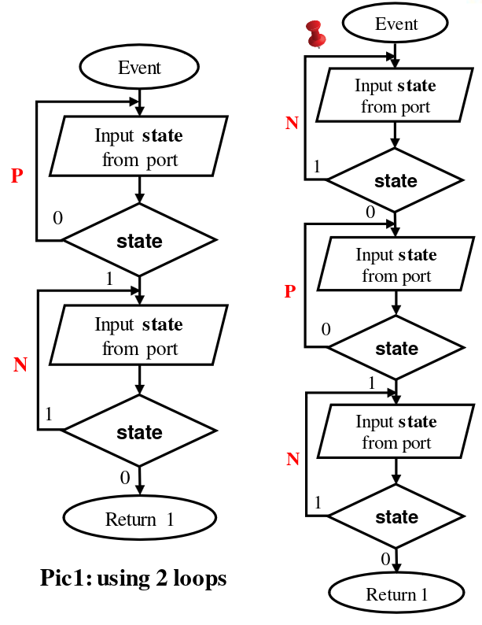

Lab 02: Blink LED base on off-on-off sequence signal from switch
==============

***Tutorial for lab2 in course microcontroller at HUST***

**Author:** *deLini1612*

---

**In a nutshell:**
1. Write function to set, clear the value of 1 bit (using MASK)
2. Write a program which detects *off-on-of* sequence signal from switch then blinked LED in 1 second

---
# Table of Contents
- [Requirements](#requirements)
- [Task 1: Determine addresses of GPIO 1 and GPIO 2 and addresses of related registers](#task-1-determine-addresses-of-gpio-1-and-gpio-2-and-addresses-of-related-registers)
- [Task 2: Write function to set, clear the value of 1 bit (using MASK)](#task-2-write-function-to-set-clear-the-value-of-1-bit-using-mask)
- [Task 3: Blink LED base on off-on-off sequence signal from switch](#task-3-blink-led-base-on-off-on-off-sequence-signal-from-switch)
  - [SPEC and Port Description](#spec-and-port-description)
    - [SPEC](#spec)
    - [Port Description](#port-description)
  - [Architecture](#architecture)
  - [Algorithm for event() function](#algorithm-for-event-function)
  - [Explain Code](#explain-code)
    - [Step 1:](#step-1)
    - [Step 2:](#step-2)
    - [Step 3:](#step-3)


---
# Requirements

1. Read ***esp32-c3_technical_reference_manual*** and determine addresses of GPIO 1 and GPIO 2
2. Write function to set, clear the value of 1 bit (using MASK)
3. Write a program which detects *off-on-of* sequence signal from switch then turn on LED for 1 second
4. Prepare physical kit (connect switch to GPIO 1 and LED to GPIO 2)

---

# Task 1: Determine addresses of GPIO 1 and GPIO 2 and addresses of related registers
1. Navigate to page 90, "*table 3-3. Module/Peripheral Address Mapping*", you can see ***base address*** of GPIO is 0x6000_4000
2. Jump into page 167-168, you can see offset address of register with base address is ***0x6000_4000 (GPIO)***:
    - `GPIO_FUNC1_OUT_SEL_CFG_REG`: Configuration register for GPIO1 output - offset `0x0558`
    - `GPIO_FUNC2_OUT_SEL_CFG_REG`: Configuration register for GPIO2 output - offset `0x055C`
    - `GPIO_IN_REG`: GPIO input register - offset 0x003C (better set and clear using `GPIO_IN_W1TS_REG`, `GPIO_IN_W1TC_REG`)
    - `GPIO_OUT_REG`: GPIO output register - offset 0x0004 (better set and clear using `GPIO_OUT_W1TS_REG`, `GPIO_OUT_W1TC_REG`)
    - `GPIO_ENABLE_REG`: GPIO output enable register - offset 0x0020
3. Jump into page 168-169, you can see offset address of register with base address is ***0x6000_9000 (IO MUX)***:
    - `IO_MUX_GPIO1_REG`: IO MUX configuration register for pin XTAL_32K_N (GPIO1) - offset `0x0008`
    - `IO_MUX_GPIO2_REG`: IO MUX configuration register for pin GPIO2 - offset `0x000C`


---
# Task 2: Write function to set, clear the value of 1 bit (using MASK)
- A ***MASK*** of n-th bit is a binary number which is has only n-th bit equals 1, all the remaining bits are 0. It means that a mask of n bit is "1 shift left n bit"
    ```C
    #define MASK(n) ((uint32_t) 1U << (n))
    ```
- If you want to clear n-th bit, you have to ***AND with invert*** of MASK(n)
- If you want to set n-th bit, you have to ***OR*** with MASK(n)
- You can find example functions to set, clear a bit we built in file [example_set_clear.c](./example_set_clear.c)

---
# Task 3: Blink LED base on off-on-off sequence signal from switch

## SPEC and Port Description
---
### SPEC
- Input: 1 bit represent state of switch (0 = OFF and 1 = ON)
- Output: 1 bit represent state of LED (0 = OFF and 1 = ON)
- Relationship between input and output: System detects sequence OFF-ON-OFF (0-1-0) at the input pin, then set output to blink LED for 1 second

### Port Description
- IO1 - Input: Connect with a switch
- IO2 - Output: Connect with anode of a LED

<p align="center">
  
</p>

---
## Architecture
- 2 functions
  - event(): detects 0-1-0 sequence at input pin
  - main(): calls event() function, then set, clear output to blink LED

---
## Algorithm for event() function
Using 2 type of loop:
  - P: detect positive edge of input (0->1)
  - N: detect negative edge of input (1->0)

> Using 3 loop in N-P-N order to detect (use the first additional N loop in order to verify that in case at the start time, if switch is ON: only when ON-OFF-ON-OFF the LED will blink instead of blink right after ON-OFF)

For example: if at start time, switch’s state is **1 (ON)**
- If we only use 2 loops (as pic 1): The first loop will auto pass. We only need to turn off the switch, the state of switch will be 0. Therefore, the return value of event() will be 1 eventhe input signal is just ***ON-OFF***.
- To deal with this case (and still correct in case the switch is OFF at start time), we use 3 loops

<p align="center">
  
</p>

---
## Explain Code
Source code is provided in [main.c](./main.c) with header file [lib.h](./lib.h)
### Step 1:
Declare Register using Struct (in this lab exersice, we just declare gpio and io_mux register for the simplicity)

  ---
### Step 2:
1. Set GPIO-n pin as simple output and write:
   - First, we need to write 128 to coresponding `gpio_func_out_sel` field to set up a GPIO as simple output.
   - Set `gpio_func_oen_sel` bit to force the output enable to be source from `gpio_enable_reg` register.
   - Enable GPIO output by setting n-th bit of `gpio_enable`_reg to 1 using `gpio_enable_w1ts_reg`
   - To write GPIO, set n-th bit of `gpio_out_w1ts_reg` (to write 1) or `gpio_out_w1tc_reg` (to write 0)
2. Set GPIO-n pin as simple input:
- Disable GPIO output by clearing n-th bit of `gpio_enable_reg` using `gpio_enable_w1tc_reg`
- Enable internal pull-down and input by set 7th and 9th bit of `io_mux_gpion_reg` respectively
    >We enable internal ***pull-down*** in order to set the value of GPIO input from switch is 0 if OFF, then connect other pin of switch to Vcc (gpio value will be 1 if turn switch ON).
- Filter enabled to remove glitch by setting 15th bit of `io_mux_gpion_reg`
- To read value, read n-th bit of `gpio_in_reg`
  
  ---
### Step 3:
Write main.c() bases on the flowchart mentioned in previous slide
