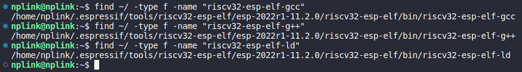
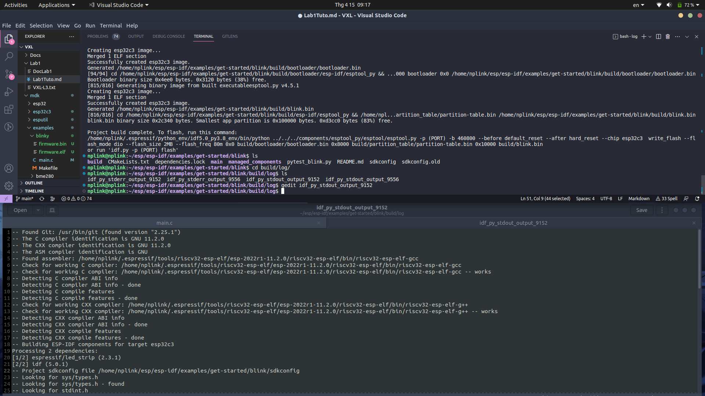
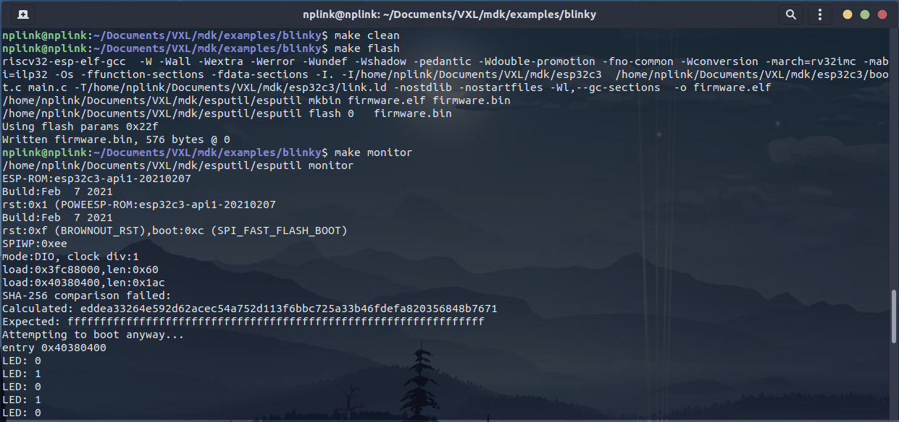
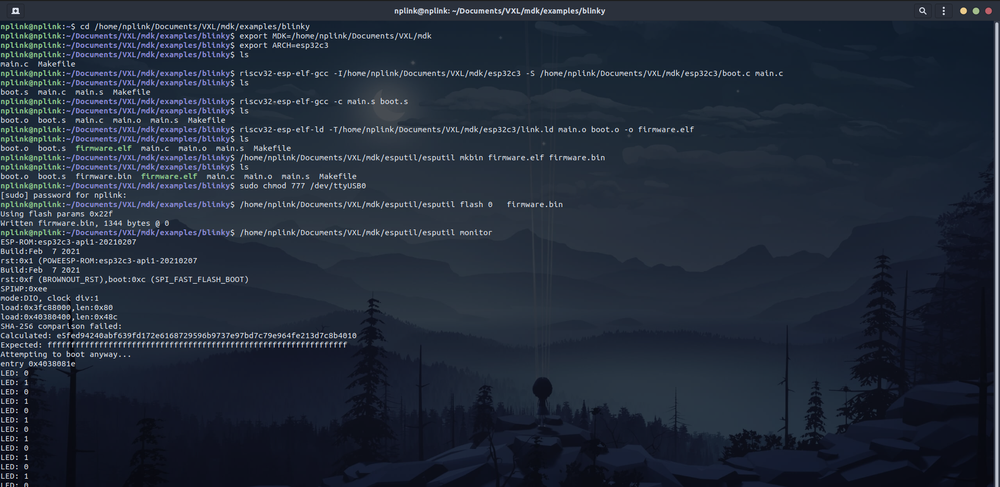

Lab 01: Blinky
==============

***Tutorial for lab1 in course microcontroller at HUST***

**Author:** *deLini1612*

---

**In a nutshell:**
1. Download espressif for esp32c3, check for the toolchain link then modify the toolchain link in [build.mk](../mdk/esp32c3/build.mk) to the toolchain link you just finded. Change target architecture in [makefile (examples)](../mdk/examples/Makefile) to esp32c3.
2. Modify the [main.c](../mdk/examples/blinky/main.c) file then run make in [blinky dir](../mdk/examples/blinky/)
3. Run make in [esputil dir](../mdk/esputil/) then flash into ESP32C3

---
# Table of Contents
- [1. Requirements](#1-requirements)
  - [Software](#software)
  - [Hardware](#hardware)
- [2. Objective](#2-objective)
- [3. Quick tutorial (step by step)](#3-quick-tutorial-step-by-step)
  - [Step 1: Find toolchain path](#step-1-find-toolchain-path)
  - [Step 2: Set PATH environment variable](#step-2-set-path-environment-variable)
  - [Step 3: Build firmware](#step-3-build-firmware)
  - [Step 4: Flash code into MCU](#step-4-flash-code-into-mcu)
  - [Step 5: Change LED pin back to GPIO and build test board LED](#step-5-change-led-pin-back-to-gpio-and-build-test-board-led)
- [4. How main.c run](#4-how-mainc-run)
  - [4.1. `gpio_output(int pin)` function](#41-gpio_outputint-pin-function)
    - [4.1.1. `REG(C3_GPIO)[GPIO_OUT_FUNC + pin] = BIT(9) | 128`](#411-regc3_gpiogpio_out_func--pin--bit9--128)
    - [4.1.2. `gpio_output_enable(pin, 1)`](#412-gpio_output_enablepin-1)
    - [**4.1.3. Conclusion**](#413-conclusion)
  - [4.2. `gpio_write(int pin, bool value)` function](#42-gpio_writeint-pin-bool-value-function)
    - [**4.2.1. Conclusion**](#421-conclusion)
- [5. Why need to add `wdt_disable()`](#5-why-need-to-add-wdt_disable)
- [6. Result](#6-result)
  - [Toolchain path](#toolchain-path)
  - [Blinky internal LED and blinky a LED via GPIO pin](#blinky-internal-led-and-blinky-a-led-via-gpio-pin)
- [7. Bonus assignment](#7-bonus-assignment)
  - [Task](#task)
  - [Our work](#our-work)
    - [Learn about -S, -c and risv32-esp-elf-nm](#learn-about--s--c-and-risv32-esp-elf-nm)
    - [Redo those compile step without using makefile](#redo-those-compile-step-without-using-makefile)
  - [Our result](#our-result)

---
# 1. Requirements

## Software
- Download Standard Toolchain Espressif for ESP32-C3 stable and follow the tutorial [here](https://docs.espressif.com/projects/esp-idf/en/v5.0.1/esp32c3/get-started/linux-macos-setup.html)
- Clone 2 repos [ESP32 flashing utility](https://github.com/cpq/esputil) and [ESP32/ESP32C3 SDK](https://github.com/cpq/mdk)

## Hardware
- ESP32-C3 kit
- Cable to load code

---
# 2. Objective
- Download toolchain, find link of toolchain.
- Build, load (flash) example blinky code (given in [here](../mdk/examples/blinky)) then make a simple LED circuit and run code to blink LED.

---
# 3. Quick tutorial (step by step)

## Step 1: Find toolchain path
There are **2 ways** in order to find toolchain path:
1. Using find **command** in ubuntu: 
    ```bash
    find ~/ -type f -name "riscv32-esp-elf-gcc"
    find ~/ -type f -name "riscv32-esp-elf-g++"
    find ~/ -type f -name "riscv32-esp-elf-ld"
    ```
2. **Build an example project** (Eg: blink in ```/esp/esp-idf/examples/get-started/blink/```) then look up the log file in build dir
    - Build blink project: Navigate to your project dir ->  config your project (set target chip, set up project variables) -> build project
        ```bash
        get_idf
        cd ~/esp/esp-idf/examples/get-started/blink/
        idf.py set-target esp32c3
        idf.py menuconfig
        idf.py build
        ```
    - Find toolchain path by looking up log file

---
## Step 2: Set PATH environment variable
To use toolchain, you will need to update your ```PATH``` environment variable.
1. Add ```PATH``` environment variable directly to your ```~/.bashrc``` then run command ```source ~/.bashrc```:
    ```
    export PATH=$PATH:/home/nplink/.espressif/tools/riscv32-esp-elf/esp-2022r1-11.2.0/riscv32-esp-elf/bin/
    ```
2. Run those command:
    ```bash
    export MDK=/home/nplink/Documents/VXL/mdk    # Points to MDK directory
    export ARCH=esp32c3         # Valid choices: esp32 esp32c3
    ```

---
## Step 3: Build firmware
1. Modify [makefile (examples)](../mdk/examples/Makefile) first line: set ARCHITECTURES to esp32c3
2. Go to our project directory: [blinky dir](../mdk/examples/blinky/) and check the MakeFile -> Makefile include ```/home/nplink/Documents/VXL/mdk/esp32c3/build.mk```, so we need to check [build.mk](../mdk/esp32c3/build.mk)
3. Modify [build.mk](../mdk/esp32c3/build.mk): set TOOLCHAIN to **riscv32-esp-elf**
4. Check [main.c](../mdk/examples/blinky/main.c) file in project dir (we will dive into understand how the code run [later](#how-mainc-run)) then modify `led_pin` to `3` to blink the LED in NodeMCU ESP32-C3 (instead of GPIO) for testing purpose. 
5. Disable Watch Dog Timer (wdt) by add `wdt_disable();` line **before for loop** (Why? we will discus [later](#why-need-to-add-wdt_disable))
6. Run `make` in [blinky dir](../mdk/examples/blinky/). After run `make`, run `ls` to check if it done right (you will see **2 new file** *firmware.bin* and *firmware.elf*)

---
## Step 4: Flash code into MCU
To flash code to MCU, we will need to use **esputil**, you can find more information [here](https://github.com/cpq/esputil) or follow my work:

1. Navigate to [esputil dir](../mdk/esputil) then check if there is a executable file esputil (if not, run `make`)
2. Flash code into MCU: Navigate to [blinky dir](../mdk/examples/blinky/). You need to give port rwxrwxrwx permissions then using `make flash` to flash code into MCU, using `make clean` and `make flash` to re flash new code
```bash
sudo chmod 777 /dev/ttyUSB0
make flash
```

---
## Step 5: Change LED pin back to GPIO and build test board LED
1. In [main.c](../mdk/examples/blinky/main.c) file in project dir modify `led_pin` to `LED1`.
    > LED1 is defined in [mdk.h](../mdk/esp32c3/mdk.h) as 2 in line 213
2. Check **Pin function definition table** in ESP32-C3-32S specification set up a test board with LED: anode is connected with IO2 ([why IO2?](#how-mainc-run)) and cathode is connected with GND
3. Run command `make monitor` to see status of LED1
    > Notice that when pin 2 (IO2) is 0V (Low level), the LED is off 

---

# 4. How [main.c](../mdk/examples/blinky/main.c) run
It include [mdk.h](../mdk/esp32c3/mdk.h) and it contains bsp (address of I/O registers, some functions, ...).

---
## 4.1. `gpio_output(int pin)` function
In [main.c](../mdk/examples/blinky/main.c), we call `gpio_output(led_pin)` function, so look up to its definition in [mdk.h](../mdk/esp32c3/mdk.h), then you can see it from lines 130 to 133, we'll understand it line by line
```c
static inline void gpio_output(int pin) {
  REG(C3_GPIO)[GPIO_OUT_FUNC + pin] = BIT(9) | 128;
  gpio_output_enable(pin, 1);
}
```
### 4.1.1. `REG(C3_GPIO)[GPIO_OUT_FUNC + pin] = BIT(9) | 128`   
- `GPIO_OUT_FUNC` is defined as `341` in line 59, 341 register = 1364 bytes = 0x0554
- `C3_GPIO` is defined as `0x60004000` in line 34 (it also the low **boundary address of GPIO** [page 90 technical reference manual])
- `REG(x)` is defined in line 14, and let's take it take it one step at the time:
  ```c
  #define REG(x) ((volatile uint32_t *) (x))
  ```
  1. `x` is your memory address
  2. `(uint32_t *) (x)` is a pointer to `x` memory address, of type **uint32_t** meaning 32 bit unsigned integer
  3. `volatile` added to tell compile to avoid to optimize.
  > So, `REG(x)` mean a pointer point to memory address `x`
- `BIT(x)` is defined in line 13:
    ```c
    BIT(x) ((uint32_t) 1U << (x))
    ```
    > What happens in this command is 1U (unsigned value 1) is shifted to the left by x bits, so its value is 2^x

***In a nutshell:*** 
- `REG(C3_GPIO)[GPIO_OUT_FUNC + pin]` will have base address is **0x60004000** (C3_GPIO) and offset address is (0x0554+4\*pin). So `REG(C3_GPIO)[GPIO_OUT_FUNC + pin]` is `GPIO_FUNCn_OUT_SEL_CFG_REG` (n = pin) means configuration register for GPIO*n* output [table in page 168 of technical reference manual].
- `REG(C3_GPIO)[GPIO_OUT_FUNC + pin] = BIT(9) | 128` means set the `GPIO_FUNCn_OUT_SEL_CFG_REG` to 00000000 00000000 00000010 10000000 (9th and 7th bit is 1, others bit is 0)
- Check *Register 5.18* in page 176 of technical reference manual for `GPIO_FUNCn_OUT_SEL_CFG_REG`:
  - [7:0] bit = 10000000: the peripheral output signal 128 will be connected to GPIO output n
  - 9th bit = 1: force the output enable signal to be sourced from bit n of `GPIO_ENABLE_REG` (which can be enable by `gpio_output_enable(pin, 1)` command)

### 4.1.2. `gpio_output_enable(pin, 1)`
From line 125-128, we have:
```c
static inline void gpio_output_enable(int pin, bool enable) {
  REG(C3_GPIO)[GPIO_OUT_EN] &= ~BIT(pin);
  REG(C3_GPIO)[GPIO_OUT_EN] |= (enable ? 1U : 0U) << pin;
}
```
- `GPIO_OUT_EN` is defined as `8` in line 59, so the offset is 8 register (8 register means 32 byte = 0x0020), so `REG(C3_GPIO)[GPIO_OUT_EN]` will have **0x600004000** as base address and **0x0020** is the offset. Therefor, `REG(C3_GPIO)[GPIO_OUT_EN]` is `GPIO_ENABLE_REG` [table in page 167 of technical reference manual]
- `GPIO_ENABLE_REG` is ***GPIO output enable register*** [*Register 5.5* in page 171 of technical reference manual]; is use to GPIO output enable register for GPIO0 ~ 21 (Bit0 ~ bit21 are corresponding)
- The code means line by line:
  - First, you mask all bit of `GPIO_ENABLE_REG` except the "pin"-th bit (set it to 0)
  - Then set the "pin"-th bit to 1 (enable GPIO-"pin") if `enable==1`, otherwise set it to 0 (do not enable the "pin"-th GPIO)

### **4.1.3. Conclusion**
- `gpio_output(int pin)` function will connect the peripheral output signal 128 to GPIO-"pin" output and enable the GPIO-"pin"
    > In case we set `led_pin = LED1` in [main.c](../mdk/examples/blinky/main.c), We will enable GPIO2, which is IO2 pin in ESPC3-32S kit

  ---
## 4.2. `gpio_write(int pin, bool value)` function
From line 135 to 138, we have:
```c
static inline void gpio_write(int pin, bool value) {
  REG(C3_GPIO)[1] &= ~BIT(pin);              // Clear first
  REG(C3_GPIO)[1] |= (value ? 1U : 0U) << pin;  // Then set
}
```
- 1 register = 4 byte = 0x0004, so `REG(C3_GPIO)[1]` is GPIO output register `GPIO_OUT_REG` [table in page 167 of technical reference manual].
- The code means line by line:
  - First, you mask all bit of `GPIO_OUT_REG` except the "pin"-th bit (set it to 0). It means keep the output value of all GPIO except for GPIO-"pin" (It will be cleared)
  - Then set the "pin"-th bit to value: output value of GPIO-"pin" is 1 if `enable==1` and otherwise

### **4.2.1. Conclusion**
- `gpio_write(int pin, bool value)` function will write the GPIO-"pin" value to `value`
    > In case we set `led_pin = LED1` in [main.c](../mdk/examples/blinky/main.c), We will write the output to GPIO2, which is IO2 in ESPC3-32S kit

---
# 5. Why need to add `wdt_disable()`
A **watchdog timer** (WDT) is a timer that monitors microcontroller (MCU) programs to see if they are out of control or have stopped operating. It acts as a “watchdog” watching over MCU operation (you can read more about WDT [here](https://www.ablic.com/en/semicon/products/automotive/automotive-watchdog-timer/intro/))
- The WDT uses a number of methods (modes) to detect MCU faults and the type of faults it detects varies with the mode
  - Time-out mode
  - Window mode
  - Q&A (Question & Answer) mode
- When we run ***blinky*** project to blink a LED, the GPIO (LED) status will be change between 2 state on and off depends on a specific cycle (on -< off -> on -> off > ...)
- However, if there are some errors such as the program is in a infinite loop (for loop in line 11 in [main.c](../mdk/examples/blinky/main.c)), WDT will be activate and reboot the MCU. So the LED might be not blink. So we have to disable watchdog timer by `wdt_disable()` function.

---
# 6. Result
We follow the tutorial we made [before](#quick-tutorial-step-by-step), and this section will show our result

## Toolchain path
Our toolchain path:
```
1. /home/nplink/.espressif/tools/riscv32-esp-elf/esp-2022r1-11.2.0/riscv32-esp-elf/bin/riscv32-esp-elf-gcc

2. /home/nplink/.espressif/tools/riscv32-esp-elf/esp-2022r1-11.2.0/riscv32-esp-elf/bin/riscv32-esp-elf-g++

3. /home/nplink/.espressif/tools/riscv32-esp-elf/esp-2022r1-11.2.0/riscv32-esp-elf/bin/riscv32-esp-elf-ld
```
<p align="center">
  
</p>
<p style="text-align: center;">Using find command</p>

<p align="center">
  
</p>
<p style="text-align: center;">Finding by build a sample project</p>

---
## Blinky internal LED and blinky a LED via GPIO pin
1. For testing, modify ***led_pin*** static int variable to ***3*** and run `make clean`, `make flash` to blinky the internal LED
2. Modify ***led_pin*** static int variable to ***LED1***
3. Set up experiment: We use a test board, a 10k Ohm resistor and a red LED to set up our experiment. Resistor is connect series with LED, anode of LED is connected with IO2 and cathode is connected with GND (like below pic)
4. Run `make clean`, `make flash` and `make monitor` to clean, load code and show status of GPIO LED pin in terminal 
5. The results of both situations can be seen in videos uploaded in [ResultVid dir](./ResultVid)
<p align="center">
  
</p>
<p style="text-align: center;">Make flash and make monitor</p>

---

# 7. Bonus assignment
## Task
1. Learn about -S, -c and risv32-esp-elf-nm tool.
2. Redo those compile step: ".c -> .s -> .o -> .elf -> .bin" without using makefile

    ---
## Our work
### Learn about -S, -c and risv32-esp-elf-nm
1. If you only want some of the stages of compilation, you can use -x (or filename suffixes) to tell gcc where to start, and one of the options -c, -S, or -E to say where gcc is to stop
   - `S`
     - Stop after the stage of compilation proper; do not assemble.
     - The output is in the form of an assembler code file (**".s"** or **".asm** file) for each non-assembler input file specified (input files that don’t require compilation are ignored)

   - `-c`
   	- Compile or assemble the source files, but do not link. The linking stage simply is not done.
   	- The ultimate output is in the form of an object file (**".o"** file) for each source file (unrecognized input files, not requiring compilation or assembly, are ignored)

2. When compiling the program, the compiler needs the header files to compile the source codes; the linker needs the libraries to resolve external references from other object files or libraries. The compiler and linker will not find the headers/libraries unless you set the appropriate options, which is not obvious for first-time user.
   - The include-paths are specified via `-Idir` option (or environment variable `CPATH`)
   - The library-path is specified via `-Tdir` option
  
3. About riscv32-esp-elf-nm tool: This tool generate a list of global symbols (ulp_app_name.sym) in the ELF file

    ---
### Redo those compile step without using makefile
1. Compilation: We have `.c` file, to generate `.s` file, the compiler (which is ***riscv32-esp-elf-gcc***) compiles the source code into assembly code for a specific processor. To do so, use `-Idir` and `-S`
   ```bash
   riscv32-esp-elf-gcc -I/home/nplink/Downloads/test/mdk/esp32c3 -S /home/nplink/Downloads/test/mdk/esp32c3/boot.c main.c
   ```
    >The `-S` option specifies to produce assembly code, instead of object code. The resultant assembly files are "main.s" and "boot.s".
2. Assembly: The assembler (which is ***riscv32-esp-elf-gcc***) converts the assembly code (`.s` file) into machine code in the object file (`.o` file). Use `-c` option as the following
   ```bash
   riscv32-esp-elf-gcc -c main.s boot.s
   ```
    > The resultant object files are "main.o" and "boot.o".
3. Linker: The linker (which is ***riscv32-esp-elf-ld***) links the object code with the library code to produce file `.elf`. Use `-T` to specify the linker script and `-o` option to set name for the output file
   ```bash
   riscv32-esp-elf-ld -T/home/nplink/Downloads/test/mdk/esp32c3/link.ld main.o boot.o -o firmware.elf
   ```
    > The result is "firmware.elf".
4. Crete `.bin` file from `.elf` file by ***esputil***
   ```bash
   /home/nplink/Downloads/test/mdk/esputil/esputil mkbin firmware.elf firmware.bin
   ```
    > The result is "firmware.bin" file, which will be flashed to MCU
5. Flash `.bin` file to MCU using ***esputil***
   ```bash
   sudo chmod 777 /dev/ttyUSB0
   /home/nplink/Downloads/test/mdk/esputil/esputil flash 0   firmware.bin
   ```
  ---
## Our result
This is the capture picture we do the compile step: ".c -> .s -> .o -> .elf -> .bin" without using makefile. After each step, we use `ls` to check the result files.

Then we flash `.bin` file to MCU and check the status of GPIO by `esputil monitor` as well as observe the real-life LED board.
<p align="center">
  
</p>
<p style="text-align: center;">Make flash and make monitor</p>